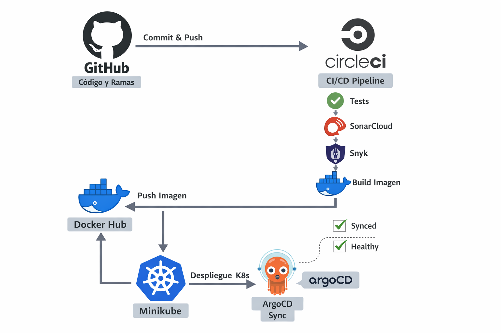

# API de Tareas - Práctica Final CI/CD

## 📋 Sobre esta práctica

Esta es mi práctica final del módulo de CI/CD del bootcamp de DevOps. El objetivo era montar un pipeline completo de integración y despliegue continuo para una aplicación dockerizada.

Decidí aprovechar una API REST de tareas (TODO list) que ya tenía de otro proyecto en lugar de un simple "Hola Mundo" porque quería practicar con algo más cercano a un proyecto real, aunque sin complicarme demasiado y así poner en práctica todos los conocimientos que he ido adquiriendo.

## 🛠️ ¿Qué he montado?

- Una API REST con Python/Flask que guarda tareas en PostgreSQL
- Todo contenerizado con Docker
- Pipeline de CI/CD con CircleCI
- Tests automáticos y análisis de calidad
- Publicación de la imagen en Docker Hub
- Despliegue en Kubernetes (local con Minikube)
- Sincronización automática con ArgoCD

## 🚀 Tecnologías

- **Backend**: Python 3.11 + Flask
- **Base de datos**: PostgreSQL 15
- **Contenedores**: Docker + Docker Compose
- **CI/CD**: CircleCI
- **Calidad**: SonarCloud + flake8 + pylint
- **Seguridad**: Snyk
- **Registro**: Docker Hub
- **Orquestación**: Kubernetes (Minikube)
- **GitOps**: ArgoCD

## 📂 Estructura del proyecto
```
practica-apitodo/
├── app/
│   ├── main.py              # Código de la API
│   ├── requirements.txt     # Dependencias de producción
│   ├── Dockerfile           # Imagen de la aplicación
│   └── templates/
│       └── index.html       # Interfaz web simple
│
├── k8s/                     # Manifiestos de Kubernetes
│   ├── namespace.yaml
│   ├── api-deployment.yaml
│   ├── api-service.yaml
│   ├── postgres-statefulset.yaml
│   ├── postgres-service.yaml
│   └── postgres-secret.yaml
│
├── tests/
│   └── test_main.py         # Tests de la API
│
├── .circleci/
│   └── config.yml           # Pipeline de CI/CD
│
├── docker-compose.yml       # Para desarrollo local
├── requirements-dev.txt     # Dependencias de testing
├── .flake8                  # Config del linter
├── .pylintrc                # Config de pylint
├── sonar-project.properties # Config de SonarCloud
└── README.md
```

## 🌿 Gestión de ramas (Git Flow)

He trabajado con una estructura simple:

- `main` → Producción (aquí se despliega automáticamente)
- `develop` → Integración de cambios
- `feature/*` → Nuevas funcionalidades

Por ejemplo, para añadir el pipeline de CircleCI creé una rama `feature/circleci`, hice los cambios allí, los probé, y luego hice merge a `develop` y finalmente a `main`.

## 🔄 Pipeline de CI/CD (CircleCI)

El pipeline está en `.circleci/config.yml` y se ejecuta automáticamente en cada push.

### Pasos del pipeline:

1. **Instalación** → Instala las dependencias
2. **Tests** → Ejecuta pytest con cobertura
3. **Linting** → Comprueba el estilo con flake8
4. **Análisis estático** → Revisa el código con pylint
5. **SonarCloud** → Analiza la calidad del código
6. **Snyk** → Busca vulnerabilidades en dependencias
7. **Build Docker** → Construye la imagen
8. **Publish** → Sube la imagen a Docker Hub (solo en `main`)
9. **Update manifest** → Actualiza el manifiesto de K8s con el nuevo tag de imagen y hace commit al repo


## 🧪 Tests y calidad de código

El pipeline ejecuta automáticamente:

- **Tests** con pytest y reporte de cobertura
- **Linting** con flake8 (estilo PEP8)
- **Análisis estático** con pylint
- **Calidad de código** con SonarCloud
- **Vulnerabilidades** con Snyk

## 🐳 Docker

### Desarrollo local con Docker Compose

Para probar en local sin complicarme y asegurarme el correcto funcionamiento de la app antes de realizar ningún test (por eso dejé el el "docker-compose.yaml" en el repo):
```bash
docker-compose up --build
```

Esto levanta la API y PostgreSQL con todo configurado.

### Imagen publicada

La imagen se publica automáticamente en Docker Hub una vez integrado el pipeline en CircleCI cuando hago merge a `main`:

**Repositorio**: `cristianllor/apitodo`

Se generan dos tags:
- `latest` → Última versión
- `<commit-hash>` → Versión específica por commit

Además de publicar la imagen, el pipeline actualiza el manifiesto `k8s/api-deployment.yaml` con el nuevo tag generado. Así el cambio también queda reflejado en Git y ArgoCD puede detectarlo y desplegarlo.

### ☸️ Kubernetes y ArgoCD

He desplegado la aplicación en Kubernetes usando Minikube y ArgoCD para la sincronización del estado del clúster con lo definido en Git.

Los manifiestos están en la carpeta `k8s/` e incluyen:
- Deployment y Service para la API
- StatefulSet y Service para PostgreSQL
- Secret para las credenciales

### GitOps con ArgoCD

ArgoCD toma como referencia el contenido del repositorio Git. Esto significa que no detecta directamente que una imagen en Docker Hub haya cambiado, sino que detecta cambios en los manifiestos de Kubernetes almacenados en Git.

Por eso, en mi caso el flujo final queda así:

1. Hago un cambio en el código de la aplicación
2. CircleCI ejecuta tests, calidad y seguridad
3. Si todo va bien en `main`, publica una nueva imagen en Docker Hub
4. El pipeline actualiza automáticamente `k8s/api-deployment.yaml` con el nuevo tag de imagen
5. Ese cambio se sube al repositorio
6. ArgoCD detecta que Git ha cambiado y que el clúster está desincronizado
7. Se sincroniza el despliegue y Kubernetes aplica la nueva versión

De esta forma, ArgoCD no depende de detectar cambios en Docker Hub directamente, sino del cambio en Git, que es la fuente de verdad del despliegue.

```bash
# Acceder a ArgoCD
kubectl port-forward svc/argocd-server -n argocd 8080:443

# Obtener la contraseña inicial del usuario admin
kubectl -n argocd get secret argocd-initial-admin-secret -o jsonpath="{.data.password}" | base64 -d; echo
```
Después se accede desde el navegador a: https://localhost:8080

Usuario: admin | Password: "El que obtuvimos antes"

**Nota sobre secretos**: Para esta práctica he usado credenciales de prueba que están en el repositorio. En producción esto **NO es recomendable** y se deberían usar herramientas como Sealed Secrets o gestores de secretos.


## 🎯 Flujo completo del proyecto



Así funciona todo junto:

1. **Desarrollo**: Trabajo en una rama `feature/`
2. **Push**: Subo los cambios a GitHub
3. **CI**: CircleCI ejecuta tests, cobertura, linting y análisis
4. **Merge a main**: Si todo está correcto, integro el cambio en la rama principal
5. **Build & Publish**: CircleCI construye y sube la nueva imagen a Docker Hub
6. **Update manifest**: CircleCI actualiza `k8s/api-deployment.yaml` con el nuevo tag de imagen
7. **Commit automático**: El pipeline sube ese cambio al repositorio
8. **GitOps**: ArgoCD detecta el cambio en Git
9. **Despliegue**: Kubernetes aplica el nuevo estado

## 🚧 Problemas que encontré

### 1. Contenedores fantasma de Docker Compose

Al principio me daba errores de "container already exists". Lo solucioné limpiando bien con:
```bash
docker-compose down -v --remove-orphans
```

### 2. PostgreSQL no estaba listo

La API intentaba conectarse antes de que PostgreSQL estuviera lista. Lo arreglé añadiendo `healthcheck` en docker-compose y `depends_on` con condición.

### 3. CircleCI y las claves de API

Configurar las variables de entorno en CircleCI (Docker Hub, SonarCloud, Snyk) me llevó un rato hasta entender bien cómo funcionaban los contexts y las project settings.

## 📚 Lo que he aprendido

- A montar un pipeline de CI/CD completo desde cero
- La importancia de los tests automatizados y la calidad de código
- Cómo integrar herramientas de análisis de seguridad
- El concepto de GitOps y cómo aplicarlo con ArgoCD
- Que la documentación es tan importante como el código
- A debuggear errores de Docker y Kubernetes leyendo logs

## 🔗 Enlaces

- **Repositorio**: [GitHub - practica-apitodo](https://github.com/crisTTori/practica-apitodo)
- **Docker Hub**: [cristianllor/apitodo](https://hub.docker.com/repository/docker/cristianllor/apitodo/general)
- **Pipeline config**: [Enlace a fichero](.circleci/config.yml)
- **Pipeline CircleCI**: [Captura](./docs/SS-CircleCI.png)
- **Manifiestos Kubernetes**: [Enlace a ficheros](k8s/)
- **Aplicación desplegada**: [Captura](./docs/SS-app.png)
- **ArgoCD**: [Captura](./docs/SS-argocd.png)
- **SonarCloud**: [Proyecto](https://sonarcloud.io/project/overview?id=crisTTori_practica-CICD)
- **Snyk**: [Captura](./docs/SS-Snyk.png)
- **Vídeo explicativo**: [YouTube](https://youtu.be/kIO4taHktEY)

## 📝 Notas finales

Este proyecto ha sido un buen ejercicio para juntar todo lo que hemos visto en el módulo. No es perfecto (seguro que hay cosas que se pueden mejorar), pero funciona y cumple con los requisitos de la práctica.

---

**Cristian Llorente**  
Bootcamp DevOps & Cloud Engineering - KeepCoding  
Marzo 2025