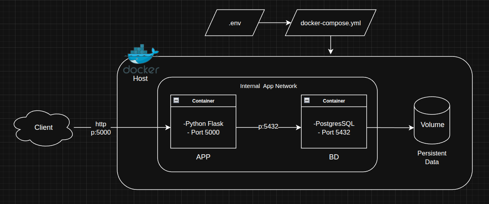

# To-Do API Microservice 🚀

Este proyecto es una API de gestión de tareas (To-Do List) desarrollada para la práctica final del módulo Docker. Consiste en un microservicio en **Python (Flask)** que interactúa con una base de datos **PostgreSQL**.

## 🏗️ Arquitectura del Proyecto

El despliegue se basa en una arquitectura de microservicios orquestada con **Docker Compose**, tal como se muestra en el siguiente esquema:



### Componentes:
- **API (Flask):** Servicio encargado de la lógica de negocio y exposición de endpoints.
- **Database (PostgreSQL):** Almacenamiento persistente de las tareas.
- **Network:** Red interna tipo bridge para aislar la comunicación entre contenedores.
- **Volume:** Volumen persistente para asegurar que los datos no se borren al reiniciar los contenedores.

## ⚙️ Configuración

La aplicación es configurable mediante variables de entorno. Los parámetros disponibles son:

| Variable | Descripción | Valor por defecto |
| :--- | :--- | :--- |
| `DB_HOST` | Host/Servicio de la base de datos | `db-tareas` |
| `DB_NAME` | Nombre de la base de datos | `tareas_db` |
| `DB_USER` | Usuario de conexión | `admin` |
| `DB_PASS` | Contraseña de conexión | `password` |

## 🚀 Puesta en marcha

### Requisitos previos
- Docker instalado.
- Docker Compose instalado.

### Instalación y ejecución
1. Clona este repositorio.
2. Localiza el archivo `.env.example` en la raíz del proyecto.
3. Crea una copia y renónmbrala a `.env`, modificando las credenciales si queremos.
4. Desde la raíz del proyecto, ejecuta el siguiente comando para construir y levantar los servicios:

   ```bash
   docker compose up --build -d

### Probando aplicación
Podemos probar nuestra aplicación de manera interactiva poniendo la ruta en el navegador **localhost:5000"
Añadiendo tareas luego podremos comprobar la persistencia de datos haciendo un `compose down`y luego un `compose up`, de esta manera al recrear el contenedor debería seguir teniendo las tareas almacenadas-

## 📊 Logs de la aplicación
Para verificar el funcionamiento y ver los logs de la aplicación en tiempo real (STDOUT/STDERR):
```bash
docker-compose logs -f api
